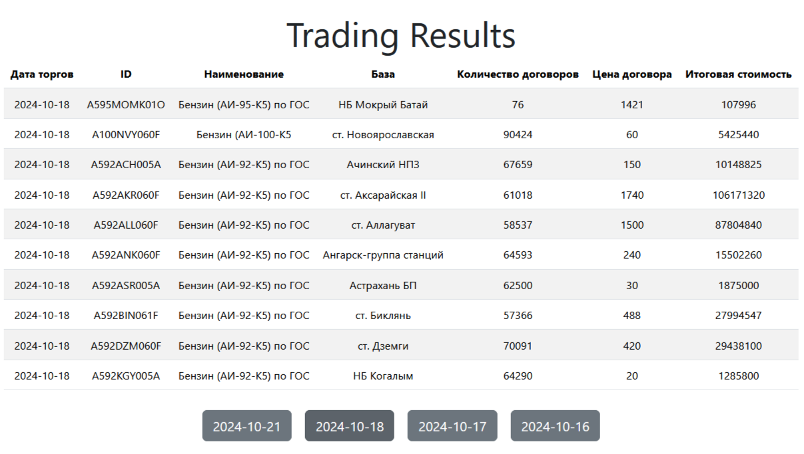

# Trading Result App

.env-non-dev заполнить

### запуск в контейнере

из корня проекта
```bash
docker compose build
docker compose up
```


### запуск локально
 - создать venv и установить зависимости
    ```bash
    pip install -r requirements.txt
    ```
 - запустить сервер redis
 - в отдельном терминале запустить celery worker
    ```bash
    cd .\trading_result_app\
    celery --app=tasks:celery worker -l INFO --concurrency 2
    ```
 -  в отдельном терминале запустить celery-beat
    ```bash
    cd .\trading_result_app\
    celery --app=tasks:celery beat -l INFO 
    ```
 - в отдельном терминале запустить flower
    ```bash
    cd .\trading_result_app\
    celery --app=tasks:celery flower  
    ```

- для демо фронтенда
    ```bash
    cd .\frontend\
    npm install
    npm run dev
    ```
    ожидаемый результат:
    


